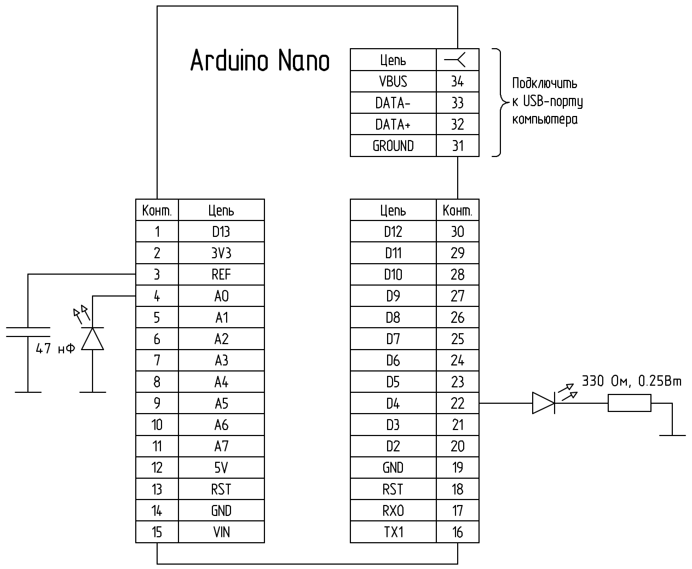
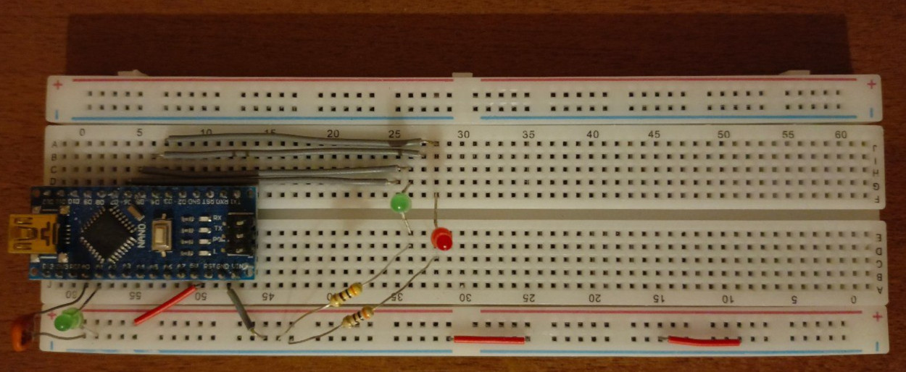

# Работа с Arduino без Arduino IDE

Далее представлены команды для IDE [Geany](https://www.geany.org/) в расчете на использование Arduino Nano

## Компиляция

```
avr-gcc -g -Os -mmcu=atmega328p -c "%f"
```

|Опция|Описание|
|-|-|
|`-g`|Produce debugging information in the operating system’s native format|
|`-Os`|Оптимизация размера кода + оптимизация `-O2`|

С другими опциями GCC можно познакомиться [здесь](https://gcc.gnu.org/onlinedocs/gcc/Option-Summary.html). С опциями avr-gcc [здесь](https://gcc.gnu.org/onlinedocs/gcc/AVR-Options.html)

## Сборка

```
avr-gcc -g -mmcu=atmega328p -o "%e.elf" "%f"
```

## Прошивка

### Через USB-порт

```
avrdude -v -p atmega328p -c arduino -P /dev/ttyUSB0 -b 57600 -D -U flash:w:"%e.elf":e
```

|Опция|Описание|
|-|-|
|`-v`|Verbose|
|`-p`|Output device|
|`-c`|Программатор|
|`-P`|Порт (взять из Arduino IDE)|
|`-b`|baud rate|
|`-D`|Disable full erase (чтобы не стереть загрузчик)|
|`-U`|Perform memory operation|
|flash|Тип памяти|
|w|Операция (запись)|
|%e.elf|Имя файла с кодом (`%e` - переменная IDE)|
|e|Тип файла для прошивки (elf)|

### Через программатор USBASP

```
avrdude -c usbasp -p atmega328p -u -U flash:w:"%e.elf":e
```

|Опция|Описание|
|-|-|
|`-u`|Disables the default behaviour of reading out the fuses three times before programming, then verifying at the end of programming that the fuses have not changed|

Данную опцию рекомендуется всегда использовать в статье по [ссылке](https://www.elecrom.com/avrdude-tutorial-burning-hex-files-using-usbasp-and-avrdude/):
*"Many times it happens that we forget to switch on the AVR’s +5V power supply, then at the end of programming cycle, avrdude detects inconsistent fuses and tries to reprogram them. Since there is no power supply, fuses gets programmed incorrectly and entire microcontroller gets screwed up(means becomes useless). Thus always use this option."*

Если к МК подключена **мощная нагрузка**,то перед загрузкой прошивки нужно обязательно [подключить внешнее питание](https://alexgyver.ru/lessons/arduino-power/)!

## Пример использования

### Условие задачи

Допустим, ко входу АЦП A0 подключен светодиод, играющий роль фотоэлемента. При превышении напряжения на А0 определенного порогового уровня должен загореться красный светодиод, подключенный к D4 (PD4). 

### Принципиальная схема экспериментальной установки (ГОСТ 2.702-2011)



### Фотография экспериментальной установки



### Код для чистого контроллера (ATmega328P)

[Ссылка на файл с кодом](test_prog_without_ArduinoIDE.с)

```c
#include <avr/io.h>
#include <avr/interrupt.h>

#define THRESHOLD 250
#define OUTPUT_PIN PD4

ISR(ADC_vect) {
	volatile unsigned int adc_val;
	volatile unsigned char low, high;

	/* При работе с 2-х байтовыми
	регистрами сначала читается
	младший байт */
	cli();
	low = ADCL;
	high = ADCH;
	adc_val = high*256+low;
		
	if (adc_val>THRESHOLD) {
		PORTD |= 1 << OUTPUT_PIN;
	} else {
		PORTD &= ~(1 << OUTPUT_PIN);
	}
	sei();
}

/* Должен быть пустой обработчик
 * прерывания, которое используется
 * для запуска АЦП */
ISR(TIMER0_COMPA_vect) {
}

int main(void) {
	/* Настройка T0 */
	/* Режим работы: CTC */
	TCCR0A |= 1 << WGM01;
	/* Предделитель: 1/1024 */
	TCCR0B |= (1 << CS02) | (1 << CS00);
	/* Регистр сравнения */
	OCR0A = 240;
	/* Прерывание при совпадении с OCR0A */
	TIMSK0 |= 1 << OCIE0A;
	
	/* Настройка ADC */
	/* Режим работы: авто */
	ADCSRA |= 1 << ADATE;
	/* Запускающее устройство: T0, совп. с OCR0A */
	ADCSRB |= (1 << ADTS1) | (1 << ADTS0);
	/* Делитель ТИ АЦП - 1/128 (fмакс < 200 КГц) */
	ADCSRA |= (1 << ADPS2) | (1<< ADPS1) | (1<<ADPS0);
	/* Источник опорного напряжения: внутренний 5В */
	ADMUX |= (0 << REFS1) | (1 << REFS0);
	/* Источник сигнала - пин ADC0 */
	/* По умолчанию */
	/* Прерывания ADC: включены */
	ADCSRA |= 1 << ADIE;
	/* Включить ADC */
	ADCSRA |= 1 << ADEN;
	
	DDRD |= 1 << OUTPUT_PIN;

	sei();
	while (1) {
	}
}
```

### Код для Arduino

Данный код приведен для сравнения и не является полным аналогом кода, приведенного выше.

[Ссылка на файл с кодом](test_led_effect_arduino.ino)

```c
#include <avr/io.h>

#define OUTPUT_PIN PD4

void setup() {
  DDRD |= 1 << OUTPUT_PIN;
}

void loop() {
  volatile unsigned int led_value;
  led_value = analogRead(A0);

  if (led_value > 250) {
    PORTD |= (1 << OUTPUT_PIN);
  } else PORTD &= ~(1<<OUTPUT_PIN);
  delay(200);
}
```

### Видео (код для чистого контроллера)

